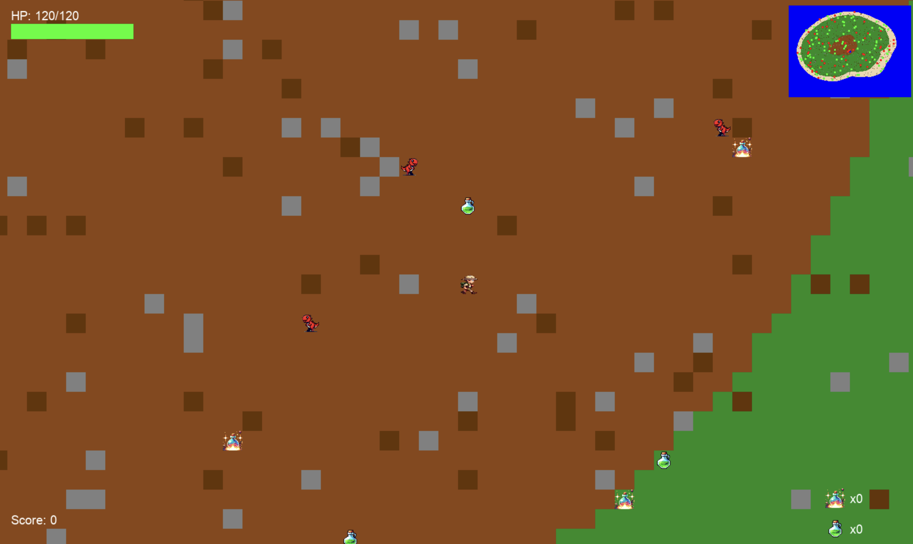

# Flucht von der Dinosaurier-Insel


**Flucht von der Dinosaurier-Insel** ist ein aufregendes Python-basiertes Spiel. Dieses Projekt diente als wunderbare Übung, um Programmierkenntnisse zu vertiefen und wertvolle gemeinsame Erinnerungen (Papa und Sohn-Erlebnis) zu schaffen.

Dieses Projekt wurde gemeinsam mit meinem 11-jährigen Sohn entwickelt. Es war eine wunderbare Gelegenheit, gemeinsam zu lernen, kreativ zu sein und wertvolle Zeit miteinander zu verbringen. Wir haben beide an verschiedenen Aspekten des Spiels gearbeitet, von der Spielmechanik über die Grafiken bis hin zur Dokumentation.

In diesem Spiel musst du auf der gefährlichen Dinosaurier-Insel überleben, indem du dich durch verschiedene Terrains bewegst, aggressive Dinosaurier vermeidest und deine Ressourcen verwaltest, bis die Rettung eintrifft.

Dieses README dient nicht nur als Anleitung für das Spiel, sondern auch als Archiv einer besonderen gemeinsamen Erfahrung.

Möge es als schöne Erinnerung dienen, wann immer wir dieses Projekt wieder aufnehmen oder auf seine Entstehung zurückblicken.

## Inhaltsverzeichnis

- [Features](#features)
- [Spielanleitung](#spielanleitung)
- [Demo](#demo)
- [Installation](#installation)
- [Nutzung](#nutzung)
- [Verzeichnisstruktur](#verzeichnisstruktur)
- [Beitragende](#beitragende)
- [Lizenz](#lizenz)
- [Danksagungen](#danksagungen)

## Features

- **Dynamische Inselkarte:** Prozedural generierte Inselkarte mit vielfältigen Biomen wie Vulkanen, Wäldern, Stränden und Gewässern.
- **Fesselndes Gameplay:** Überlebe gegen aggressive Dinosaurier, verwalte Gesundheit und Inventar und treffe strategische Entscheidungen, um am Leben zu bleiben.
- **Ressourcenmanagement:** Sammle Tränke und Repellentien, um dein Überleben zu sichern und Bedrohungen abzuwehren.
- **Tag-Nacht-Zyklus:** Erlebe eine dynamische Umgebung, die sich mit der Zeit verändert und das Verhalten der Dinosaurier sowie die Sichtbarkeit beeinflusst.
- **Soundeffekte und Musik:** Immersives Audioerlebnis mit Hintergrundmusik und Soundeffekten, die das Gameplay intensivieren.
- **Joystick-Unterstützung:** Optionale Joystick-Integration für ein verbessertes Steuerungserlebnis.
- **HUD-Elemente:** In-Game HUD zeigt Gesundheit, Punktestand, Inventar und eine Minikarte für bessere Navigation an.

## Spielanleitung

**Ziel des Spiels:** Überlebe auf der Dinosaurier-Insel, bis das rettende Boot ankommt. Vermeide gefährliche Dinosaurier, sammle nützliche Gegenstände und manage deine Ressourcen geschickt.

### Steuerung

- **Bewegen:** `W`, `A`, `S`, `D` oder Pfeiltasten
- **Repellent verwenden:** `Leertaste`
- **Trank verwenden:** `E` oder `Rechts-Shift`
- **Pause/Fortsetzen:** `ESC`
- **Joystick:** Falls aktiviert, verwende die konfigurierten Joystick-Tasten.

### Spielzustände und Steuerung

- **Hauptmenü:**
  - `ENTER`: Spiel starten
  - `H`: Hilfe anzeigen
  - `Q`: Spiel beenden

- **Spielmodus:**
  - `ESC`: Spiel pausieren
  - `Leertaste`: Repellent benutzen
  - `E`/`Rechts-Shift`: Trank verwenden

- **Pause-Menü:**
  - `ESC`: Spiel fortsetzen
  - `H`: Hilfe anzeigen
  - `M`: Musik ein-/ausschalten
  - `Q`: Spiel beenden

- **Spielende (Game Over/Win):**
  - `ENTER`: Zurück zum Hauptmenü

### Spielmechanik

- **Bewegung und Interaktion:** Navigiere durch die Insel, indem du Hindernissen ausweichst und dich strategisch bewegst.
- **Inventarverwaltung:** Sammle Tränke und Repellentien, um deine Überlebenschancen zu erhöhen.
- **Tag-Nacht-Zyklus:** Achte auf die Zeit, da sich das Verhalten der Dinosaurier je nach Tageszeit ändert.
- **Minikarte:** Nutze die Minikarte, um deine Position und die der Dinosaurier besser im Blick zu behalten.

## Demo



## Installation

### Voraussetzungen

- **Python 3.7 oder höher**: Stelle sicher, dass Python auf deinem System installiert ist. Du kannst es von [Python's offizieller Website](https://www.python.org/downloads/) herunterladen.
- **Pygame**: Das Spiel wurde mit Pygame entwickelt. Installiere es mit pip:

```bash
pip install pygame
```

### Repository klonen

```bash
git clone https://github.com/RRFOZR/flucht-von-der-dinosaurier-insel.git
cd flucht-von-der-dinosaurier-insel
```

### Abhängigkeiten installieren

Alle notwendigen Abhängigkeiten sind in der `requirements.txt` Datei aufgelistet. Installiere sie mit:

```bash
pip install -r requirements.txt
```

## Nutzung

Starte das Spiel, indem du das `main.py` Skript ausführst:

```bash
python main.py
```

Stelle sicher, dass alle Asset-Verzeichnisse (`bg_assets/`, `bg_entities/`, `sounds/`, `bg_images/`, `entities/`) vorhanden sind und korrekt in der Konfiguration referenziert werden.

## Verzeichnisstruktur

```
flucht-von-der-dinosaurier-insel/
├── bg_assets/
├── bg_entities/
├── bg_images/
├── entities/
│   ├── __init__.py
│   ├── base_entity.py
│   ├── dinosaur.py
│   ├── item.py
│   └── player.py
├── sounds/
│   └── test_sounds.py
├── input_manager.py
├── boat_manager.py
├── collision_manager.py
├── config.py
├── game.py
├── joystick_handler.py
├── pathtest.py
├── utils.py
├── spawn_manager.py
├── sound_manager.py
├── hud.py
├── screens.py
├── map_gen.py
├── main.py
├── state.py
└── README.md
```

### Dateibeschreibungen

- **main.py**: Einstiegspunkt des Spiels. Initialisiert und startet die Spielschleife.
- **game.py**: Kernlogik des Spiels, einschließlich Zustandsverwaltung, Ereignisbehandlung, Updates und Rendering.
- **config.py**: Konfigurationseinstellungen für das Spiel, einschließlich Fenstergröße, FPS, Biome, Spielereinstellungen und Asset-Pfade.
- **entities/**: Enthält alle Spielelemente wie Player, Dinosaurier und Items.
  - **player.py**: Spielercharakter mit Gesundheit, Inventar und Bewegungslogik.
  - **dinosaur.py**: Dinosaurier-Entitäten mit Verhalten zum Jagen und Fliehen.
  - **item.py**: Sammelbare Items wie Tränke und Repellentien.
  - **base_entity.py**: Basisklasse für alle Entitäten.
- **input_manager.py**: Handhabt Eingabeereignisse und verteilt sie basierend auf dem Spielzustand.
- **joystick_handler.py**: Verwalten von Joystick-Eingaben, falls aktiviert.
- **collision_manager.py**: Erkennt und behandelt Kollisionen zwischen Entitäten und Umwelthindernissen.
- **spawn_manager.py**: Verwaltet das Erzeugen von Items, Dinosauriern und Umweltelementen wie Lava.
- **map_gen.py**: Generiert die Inselkarte mithilfe des Diamond-Square-Algorithmus mit Biome-Zuweisungen.
- **utils.py**: Hilfsfunktionen für die Spielmechanik, wie Bewegungsrichtungen und Laden von Sprites.
- **sound_manager.py**: Verwalten von Soundeffekten und Hintergrundmusik.
- **hud.py**: Rendert die HUD-Elemente wie Gesundheitsbalken, Punktestand, Inventar und Minikarte.
- **screens.py**: Verwalten verschiedener Spielbildschirme wie Titelbildschirm, Hilfeseite, Pausenseite und Spielende-Bildschirm.
- **pathtest.py**: Testskript zur Überprüfung von Asset-Pfaden und dem Laden.
- **sounds/test_sounds.py**: Skript zum Testen und Überprüfen aller Sound-Assets.
- **bg_assets/**, **bg_entities/**, **bg_images/**: Verzeichnisse mit Hintergrund-Assets, Entitätensprites und Bildressourcen.

## Lizenz

Dieses Projekt ist unter der [MIT License](LICENSE) lizenziert.

## Danksagungen

- **Pygame Community**: Für das Bereitstellen eines ausgezeichneten Frameworks für die Spieleentwicklung.
- **OpenAI's ChatGPT**: Unterstützt bei der Erstellung von Teilen der Spiel-Logik und Dokumentation.
- **Familie**: Für ihre Unterstützung und Ermutigung während der Entwicklung dieses Spiels.

---
